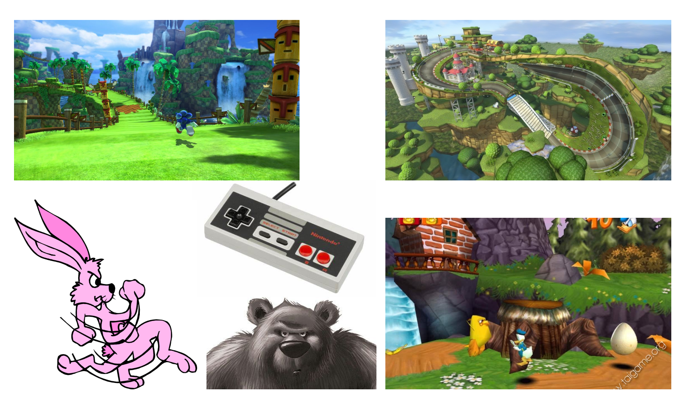
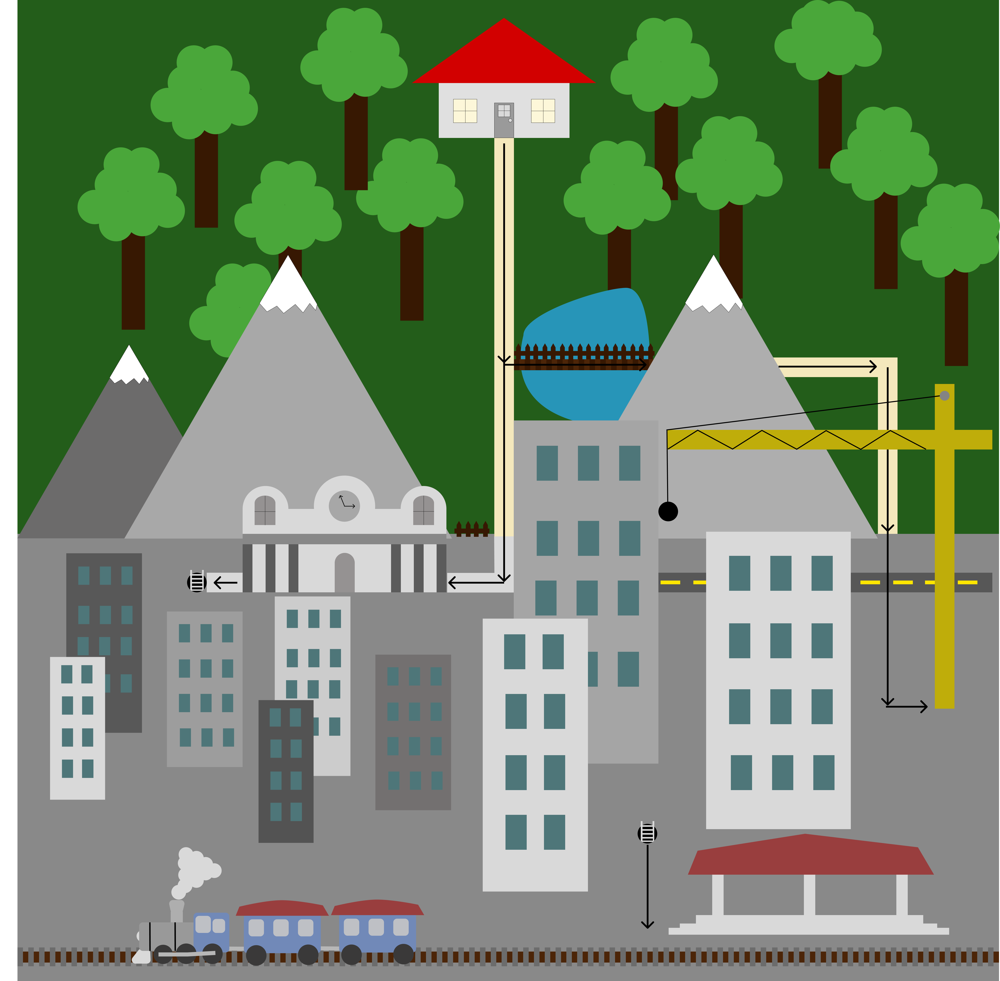
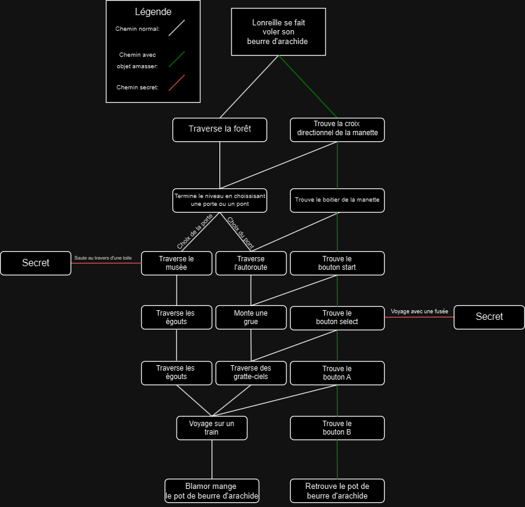

# Projet_Vr

## Résumé du projet
Le joueur joue un lapin et doit retrouver son pot de beurre d'arachide collector qui à été voler par un méchant ours gris.

## Description du projet
Vous incarnez lonreille, un lapin rose et vous devez retrouvez votre pot de beurre d'arachide collector qui a été voler par l'effroyable Blamor l'ours gris. Parcourez les différents niveaux et suivez plusiseurs chemins vers votre objectif. Deux fin sont possibles et dépendent des objets amasser par lonreille. Le style du jeu s'inspire des cartoons de l'époque de mickey mouse et des jeux de plateforme telle que sonic ou encore les jeux de course comme mario kart. Les niveaux sont conçu avec deux voies possibles.  

## Élément de gameplay du joueur
Le joueur va controller un lapin à la première personne et devra manoeuvrer ce dernier à travers les 9 niveaux (11 comptant les 2 niveaux secrets) pour se rendre a la fin du jeu et combattre Balmor l'ours gris. Le joueur va pouvoir courir, sauter, faire des sauts muraux et escalader des surfaces. Lorsque le joueur maintient la touche de saut et la relâche il effectu un saut charger et saute plus haut. Le joueur va pouvoir intéragir avec certains éléments présent dans les différents niveaux. Le joueur a un certain nombre de vie et si le compteur tombe à zéro c'est la fin de la partie. 

## Enemies
Chaques niveaux contient des enemies soit tant corriace qu'agacent. Ces derniers peuvent être vaincu de différentes façons et certains sont invulnérables au attaque jusqu'à ce que l'on trouve leur point faible(par exemple l'ennemi pourrait avoir un casque et il faudrait faire tomber une roche dessus pour le briser). À la fin des niveaux il y a un boss qui bloque l'accès vers le prochain niveau et il faut en arriver à bout pour pouvoir continuer.

## Niveaux
Le jeux comporte 9 niveaux (11 avec les zones cachées) tous se passant dans une ville. Plusieurs chemins sont possible pour arriver au dernier niveau. Dans chacun des niveaux est dissimuler un pièce de manette et une fois toute ces pièces de manette collecter nous pouvons débloquer la fin secrète.

## Moodboard Visuel

## Moodboard sonore

- https://www.youtube.com/watch?v=O2XuQq2uplU
- https://www.youtube.com/watch?v=UOC1vhYWZNQ
- https://www.youtube.com/watch?v=6xhvGjIsvjw

## Carte de l'environnement

## Schéma de programmation et d'intéractivité

