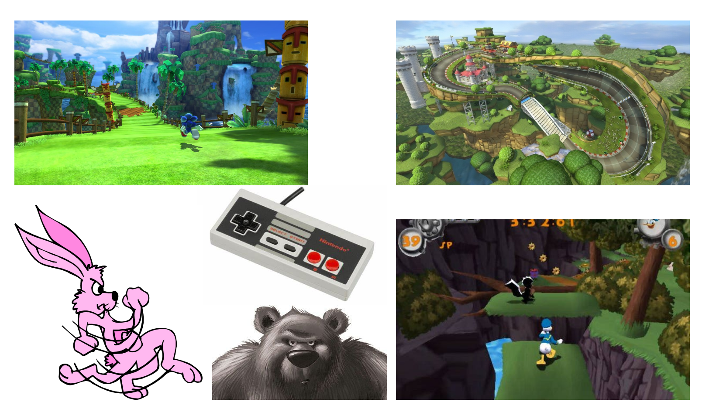

# Projet_Vr

## Résumé du projet
Le joueur joue un lapin et doit retrouver son pot de beurre d'arachide collector qui à été voler par un méchant ours gris.

## Ce que je propose
Vous incarnez lonreille, un lapin rose et vous devez retrouvez votre pot de beurre d'arachide collector qui a été voler par l'effroyable Blamor l'ours gris. Parcourez les différents niveaux et suivez plusiseurs chemins vers votre objectif. Deux fin sont possibles et dépendent des objets amasser par lonreille. Le style du jeu s'inspire des cartoons de l'époque de mickey mouse et des jeux de plateforme telle que sonic ou encore les jeux de course comme mario kart. Les niveaux sont conçu avec deux voies possibles.  

## Moodboard Visuel

## Moodboard sonore

- https://www.youtube.com/watch?v=O2XuQq2uplU
- https://www.youtube.com/watch?v=UOC1vhYWZNQ
- https://www.youtube.com/watch?v=6xhvGjIsvjw

## Carte de l'environnement

## Schéma de programmation et d'intéractivité

